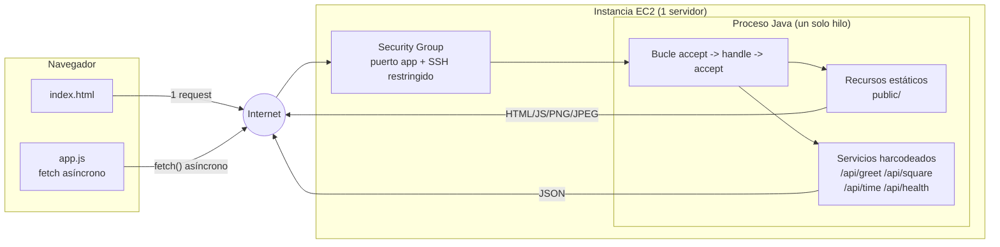
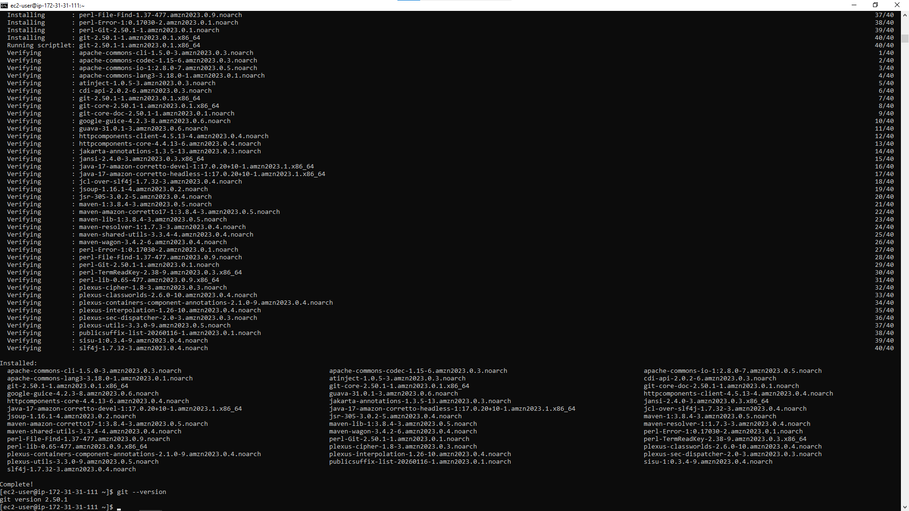
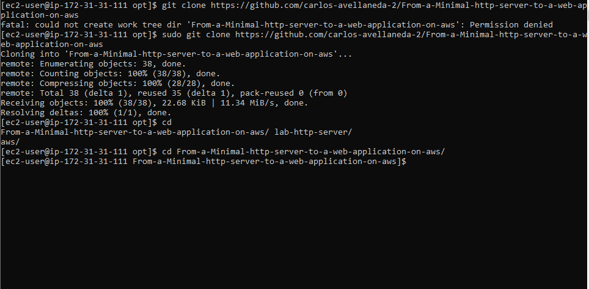
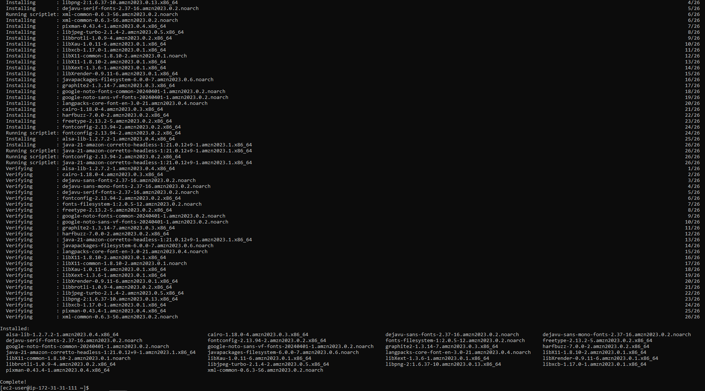
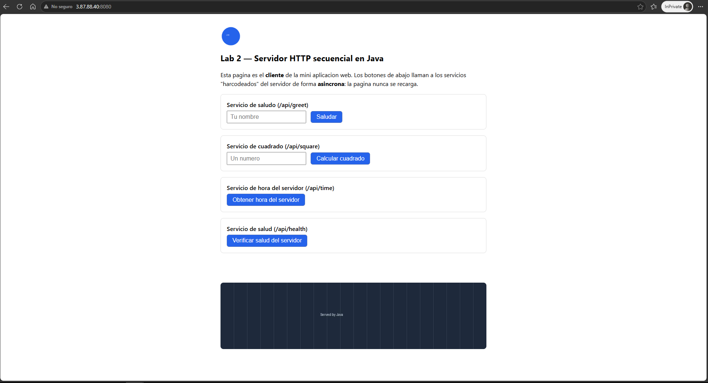

# Lab 2 — Mini Web Application (servidor HTTP secuencial)

## 1. Descripción del proyecto

Esta es una mini aplicación web construida a partir de un servidor HTTP mínimo
basado en sockets Java. El servidor:

- Sirve recursos estáticos (HTML, JavaScript, PNG, JPEG) leyéndolos como bytes.
- Expone cuatro servicios "harcodeados" (`/api/greet`, `/api/square`,
  `/api/time`, `/api/health`) que devuelven JSON.
- Procesa **una conexión a la vez**, de forma completamente secuencial: no hay
  hilos, thread pools, colas ni concurrencia de ningún tipo.
- Se despliega tal cual en **una sola instancia EC2**.

El objetivo del laboratorio no es que la aplicación escale, sino entender qué
hace un servidor de una sola conexión, dónde esperan las peticiones, y qué
supuestos habilitarán la distribución de trabajo en un laboratorio futuro.

## 2. Metáfora del sistema (system metaphor)

**Metáfora: un restaurante con un solo mesero.**

- El **navegador** es un comensal que se sienta en una mesa y hace pedidos.
- Cada **petición HTTP** (por la página, el script, una imagen, o un
  servicio) es una orden distinta que el comensal envía al mesero.
- El **mesero** es el servidor Java: solo puede atender **una orden a la
  vez**. Toma la orden completa, va a la cocina, regresa con el plato, y
  solo entonces va a la siguiente mesa (o a la siguiente orden de la misma
  mesa).
- Los **recursos estáticos** (HTML, JS, imágenes) son platos ya preparados
  que el mesero simplemente trae de la alacena (lectura de bytes desde el
  directorio `public/`).
- Los **servicios harcodeados** (`/api/greet`, `/api/square`, `/api/time`,
  `/api/health`) son platos del menú fijo: el mesero reconoce exactamente
  cuatro pedidos posibles y prepara cada uno con una receta explícita — no
  hay un "asistente de cocina automático" (framework de ruteo) que
  interprete pedidos nuevos.
- El **cliente JavaScript asíncrono** es el comensal enviando la orden y
  siguiendo conversando con la mesa mientras espera — el comensal no se
  queda paralizado, pero eso no cambia el hecho de que hay **un solo
  mesero** para todo el restaurante.
- **Desplegar a EC2** es mudar el restaurante a un nuevo local (una
  dirección pública en Internet) — pero sigue habiendo un solo mesero y una
  sola cocina.

```
Comensal (navegador)  --pedido-->  Mesero único (servidor Java, un hilo)
     ^                                     |
     |                                     v
  respuesta  <----------------------  Cocina (recursos estáticos +
                                        4 recetas harcodeadas)
```

## 3. Arquitectura



Responsabilidad de cada componente:

| Componente | Responsabilidad |
|---|---|
| `index.html` | Interfaz del cliente: formularios y botones para cada servicio. |
| `app.js` | Cliente asíncrono: llama a los servicios con `fetch`, evita el recargo de página, muestra estados de carga/éxito/error. |
| `MiniHttpServer` | Bucle `accept → handle → accept`, siempre secuencial. Único punto de entrada del proceso. |
| `ParsedRequest` | Parseo de la línea de request y de la query string. |
| `StaticFileResolver` | Resuelve rutas contra `public/` y evita path traversal. |
| `ContentTypes` | Mapeo extensión → `Content-Type`. |
| `JsonUtil` | Escapado seguro de valores insertados en JSON. |
| Security Group (EC2) | Firewall a nivel de instancia: expone solo el puerto de la app y, de forma restringida, SSH. |

## 4. Decisiones de diseño

- **El servidor permanece secuencial a propósito.** El objetivo del
  laboratorio es observar la línea base antes de introducir concurrencia;
  agregar hilos ocultaría justo lo que se debe medir y entender primero.
- **Las rutas están harcodeadas** (un `switch` con cuatro casos explícitos)
  en vez de usar un framework de ruteo, reflexión o inyección de
  dependencias. Esto hace visible el mecanismo: cada URL especial se
  reconoce por comparación directa de cadenas, no por "magia" oculta.
- **El tipo de contenido se selecciona por extensión de archivo** mediante
  una tabla de búsqueda simple (`ContentTypes`), y todos los recursos se
  leen como **bytes** (`Files.readAllBytes`) — nunca como texto — para que
  el mismo camino de código sirva HTML y binarios (PNG/JPEG) sin corromper
  ninguno.
- **Las rutas no seguras se rechazan normalizando el path** y verificando
  que el resultado siga estando dentro del directorio base
  (`StaticFileResolver.resolve`). Cualquier intento de escapar con `../`
  (incluso URL-encodeado, ej. `%2e%2e`) es detectado tras decodificar y
  normalizar, y responde `400 Bad Request` sin revelar si el archivo
  externo existe.
- **El cliente es asíncrono** (usa `fetch`) para que la interfaz del
  navegador no se congele mientras espera una respuesta — pero esto es una
  propiedad del *cliente*, no del servidor. El servidor sigue atendiendo
  una conexión a la vez; ver la sección de discusión más abajo.

## 5. Estructura del proyecto

```
lab2-scalable-http-server/
├── pom.xml
├── README.md
├── .gitignore
├── public/                      # recursos estáticos servidos por el servidor
│   ├── index.html
│   ├── app.js
│   └── images/
│       ├── logo.png
│       └── banner.jpg
├── src/
│   ├── main/java/com/networkinglab/lab2/
│   │   ├── MiniHttpServer.java       # servidor secuencial (accept -> handle -> accept)
│   │   ├── ParsedRequest.java        # parseo de request line y query string
│   │   ├── StaticFileResolver.java   # resolución segura de rutas (anti path traversal)
│   │   ├── ContentTypes.java         # mapeo extensión -> Content-Type
│   │   └── JsonUtil.java             # escapado seguro para JSON
│   └── test/java/com/networkinglab/lab2/
│       ├── ContentTypesTest.java
│       ├── JsonUtilTest.java
│       ├── StaticFileResolverTest.java
│       └── ServerIntegrationTest.java  # arranca el servidor real y hace peticiones HTTP
└── deploy/
    ├── lab2-http-server.service    # unidad systemd de ejemplo para EC2
    └── run-local.sh                # script de conveniencia para correr localmente
```

## 6. Prerrequisitos

- **Java 17** o superior (JDK, no solo JRE).
- **Maven 3.8+**.
- Un navegador moderno (Chrome, Firefox, Edge) para probar el cliente.
- Cuenta de AWS aprobada por el curso, solo para la sección de despliegue.

## 7. Instalación y build

```bash
git clone <URL-de-tu-repositorio>
cd lab2-scalable-http-server

# Descarga dependencias (solo JUnit, usado en test) y corre los tests
mvn test

# Genera el jar ejecutable en target/lab2-http-server.jar
mvn clean package
```

## 8. Cómo correrlo localmente

El servidor necesita encontrar la carpeta `public/` en el directorio desde
el que se ejecuta (o en la ruta indicada por `PUBLIC_DIR`).

```bash
# Opción A: usando el script de conveniencia (desde la raíz del proyecto)
./deploy/run-local.sh 8080

# Opción B: manualmente
PORT=8080 PUBLIC_DIR=public java -jar target/lab2-http-server.jar
```

Luego abre `http://localhost:8080` en el navegador. Para detenerlo,
`Ctrl+C` en la terminal.

## 9. Cómo usar la aplicación

En la página verás cuatro acciones:

| Acción | Endpoint | Entrada | Salida | Error típico |
|---|---|---|---|---|
| Saludar | `GET /api/greet?name=Ana` | nombre (texto) | `{"greeting":"Hello, Ana!"}` | `400` si falta o está vacío `name` |
| Calcular cuadrado | `GET /api/square?value=4` | número | `{"input":4,"square":16}` | `400` si `value` falta o no es numérico |
| Hora del servidor | `GET /api/time` | ninguna | `{"serverTime":"..."}` | — |
| Salud del servidor | `GET /api/health` | ninguna | `{"status":"UP"}` | — |

Ningún envío recarga la página: el resultado o el error aparecen en las
zonas `#result` / `#error` de la misma página.

Parámetro adicional solo para pruebas (no forma parte del enunciado
original, pero ayuda a observar la sección 6.2 del laboratorio): agregar
`&delayMs=5000` a `/api/square` hace que esa petición tarde 5 segundos en
responder, útil para verificar que una segunda pestaña se queda esperando.

## 10. Cómo correr las pruebas

Automáticas (JUnit 5, incluyen pruebas de integración que arrancan el
servidor real en un puerto libre):

```bash
mvn test
```

Manuales, con `curl`, para reproducir la matriz de pruebas del laboratorio:

```bash
# Página principal
curl -i http://localhost:8080/

# Saludo válido / inválido
curl -i "http://localhost:8080/api/greet?name=Ana"
curl -i "http://localhost:8080/api/greet"

# Cuadrado válido / inválido
curl -i "http://localhost:8080/api/square?value=7"
curl -i "http://localhost:8080/api/square?value=abc"

# Hora del servidor / salud
curl -i http://localhost:8080/api/time
curl -i http://localhost:8080/api/health

# Recurso inexistente -> 404
curl -i http://localhost:8080/no-existe.html

# Método no soportado -> 405
curl -i -X POST http://localhost:8080/api/health

# Intento de path traversal -> 400 (nunca expone archivos fuera de public/)
curl -i "http://localhost:8080/%2e%2e/%2e%2e/etc/passwd"
```

Para observar la limitación secuencial (sección 6.2 del laboratorio): abre
dos pestañas, dispara en la primera
`GET /api/square?value=5&delayMs=8000` y de inmediato, en la segunda,
`GET /api/health`. La segunda pestaña queda esperando hasta que la primera
termina — el cliente es asíncrono, pero el servidor no es concurrente.

## 11. Despliegue en AWS EC2

Resumen del flujo (ver también la sección "Guía paso a paso" que te doy en
la conversación, para lo que Claude no puede ejecutar por ti):

1. **Empaquetar**: `mvn clean package` genera `target/lab2-http-server.jar`.
2. **Lanzar la instancia** EC2 (Linux, tipo aprobado por el curso) con un
   Security Group que permita: SSH (puerto 22) solo desde tu IP, y el
   puerto de la aplicación (por ejemplo 8080) desde donde el instructor
   indique.
3. **Transferir** el jar y la carpeta `public/` a la instancia, por ejemplo:
   ```bash
   scp -i tu-llave.pem target/lab2-http-server.jar ubuntu@<IP-PUBLICA>:/opt/lab2-http-server/
   scp -i tu-llave.pem -r public ubuntu@<IP-PUBLICA>:/opt/lab2-http-server/
   ```
4. **Instalar las herramientas necesarias** en la instancia. Si vas a clonar y compilar el proyecto directamente en EC2, instala Git y Maven:

   ```bash
   sudo dnf install -y git maven
   ```

   

   Como alternativa a transferir el artefacto compilado, puedes clonar el repositorio en un directorio donde el usuario tenga permisos de escritura:

   ```bash
   mkdir -p ~/lab2
   cd ~/lab2
   git clone <URL-de-tu-repositorio>
   cd From-a-Minimal-HTTP-Server-to-a-Web-Application-on-AWS
   mvn clean package
   ```

   

5. **Instalar Java** en la instancia (ej. Amazon Linux):
   ```bash
   sudo dnf install -y java-21-amazon-corretto-headless
   ```

   

6. **Configurar el servicio** con `deploy/lab2-http-server.service`
   (systemd), para que arranque de forma predecible, escriba logs al
   `journal`, y siga corriendo tras cerrar la sesión SSH.
7. **Verificar** primero dentro de la instancia (`curl localhost:8080/api/health`)
   y luego desde tu computadora usando la IP pública de la instancia.
8. **Detener y limpiar** siguiendo la sección 12.

No se publican credenciales, direcciones privadas, ni llaves en este
repositorio.

## 12. Evidencia y resultados

_(Agrega aquí tus capturas de pantalla o enlaces: ejecución local,
ejecución remota en EC2, recursos estáticos cargando en las herramientas
de desarrollador del navegador, peticiones asíncronas exitosas, y errores
controlados.)_

La aplicación quedó disponible desde la dirección pública de la instancia
EC2 y muestra los cuatro servicios del cliente web:



## 13. Limitaciones conocidas

- El servidor es **estrictamente secuencial**: una conexión a la vez, sin
  hilos ni pools.
- Solo soporta el método **GET**; cualquier otro método responde `405`.
- Las rutas de servicio son **harcodeadas** (cuatro casos fijos), no hay
  un enrutador general.
- No hay autenticación, HTTPS, ni ninguna característica de seguridad de
  nivel de producción.
- No es un servidor HTTP listo para producción: es una herramienta
  didáctica para entender la línea base antes de escalar.

## 14. Autor y agradecimientos

- Autor: Carlos Andres Avellaneda Franco
- Basado en la guía de laboratorio "Why scalability? — From a Minimal HTTP
  Server to a Web Application on AWS" del curso de Networking.
- Construido únicamente con la biblioteca estándar de Java (sin
  frameworks HTTP) y JUnit 5 para las pruebas.
